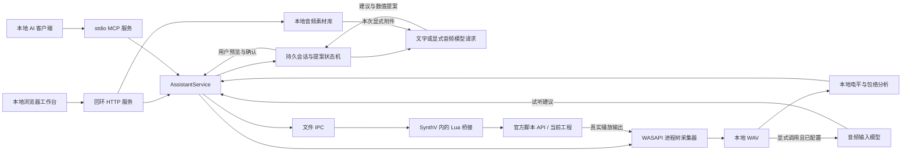

# 架构与实现边界

本项目由 `AssistantService` 编排对话规划、参数控制与真实音频流程，以 Windows 上的 Synthesizer V Studio 2 Pro 2.2.1 独立版为宿主验证基准。网页采用可调宽的三栏布局：左侧导航，中间保留会话并切换设置、素材、录音和回收站主页面，右侧工程检查器和 A/B 工具。浏览器和 MCP 都不直接操作 SynthV 内存，也不执行模型生成的任意 Lua 或系统命令。网页模型提案要求宿主实际预览和用户逐项确认；MCP 入口的人工审批由客户端负责。

## 模块职责

| 模块 | 职责 |
|---|---|
| `web/` | 三栏对话工作台、会话和素材选择、提案卡片、工程检查器与真实音频播放器 |
| `web/curves.js` | 根据当前宿主目录管理参数草稿、绘制稀疏曲线和显示实际宿主预览，不自行请求或写入工程 |
| `synthv_assistant/server.py` | 本机 HTTP、静态资源、同源访问检查和 API 路由 |
| `synthv_assistant/service.py` | 共用业务入口、录音流程、备份、编辑和评审任务 |
| `synthv_assistant/conversations.py` | 持久会话、历史预算、私有提案指纹、跨进程状态转换和应用防重放 |
| `synthv_assistant/planner.py` | 真实文字/音频模型请求、结构化参数提案、数值白名单与错误脱敏 |
| `synthv_assistant/streaming.py` | 有界 SSE 解析、跨事件凭据脱敏、实际回复和可见摘要聚合，不自动回退重试 |
| `synthv_assistant/platforms.py` | 默认平台兼容入口、命名平台 DPAPI 注册表与平台快照 |
| `synthv_assistant/model_catalog.py` | 用户主动刷新供应商目录；持久缓存按连接身份隔离，本地读取不联网 |
| `synthv_assistant/model_options.py` | 会话级平台/模型/推理选择校验及供应商参数映射；未知能力明确标注 |
| `synthv_assistant/assets.py` | 本地 WAV/MP3 导入、受控 FFmpeg 转换、附件 ID 白名单及发送大小限制 |
| `synthv_assistant/metadata.py` | 每项资源独立存储名称、备注、星标和删除标记；资源锁保护在途音频请求 |
| `synthv_assistant/settings.py` | 原有默认平台设置、DPAPI 加密、原子保存和 revision 并发检查 |
| `synthv_assistant/operations.py` | 跨进程操作锁，防止录音、预览和参数变更互相穿插 |
| `synthv_assistant/bridge.py` | Lua 文件打包、请求序列化、会话/超时检查和客户端互斥 |
| `synthv/bridge.lua` | 白名单动作、官方 API 读取、参数预览/写入/恢复、有限时长播放 |
| `synthv/pitch.lua` | 原生连续音高的坐标转换、独立快照、候选构造及写后核验 |
| `synthv_assistant/parameters.py` | 动态参数目录、增量/曲线输入契约和有界公开预览的共同校验 |
| `native/ProcessAudioCapture/` | 按指定进程树采集真实音频，生成固定格式 PCM WAV |
| `synthv_assistant/capture.py` | 原生进程启动、就绪握手、超时、结果与输出文件验证 |
| `synthv_assistant/analysis.py` | WAV 解码、电平、峰值、削波提示和真实音频包络 |
| `synthv_assistant/review.py` | 可选云音频请求、凭据隔离、返回文本和失败处理 |

## 持久会话与人工确认

主题与边栏宽度由 `web/layout.js` 管理，只在浏览器保存外观偏好。默认系统主题使用 `prefers-color-scheme` 并监听变更；手动选择优先。`web/pages.js` 管理中央主页面和独立录音流程，切页保留聊天 DOM 与未发送草稿。设置页离开时清空尚未保存的密钥，避免后台读取返回后重新填充隐藏页面。

录音页“读取选区”直接发起当前宿主读取，独立管理读取忙碌状态，不依赖右侧已经缓存的范围。发请求前清空旧起点与时长；成功后按当前选区填写，失败或无有效选区则保留空值。录音播放时长限制为 1～30 秒，超长选区只取前 30 秒并提示。此操作只读取范围，不会开始录音或调用模型。

本地备注、星标、名称覆盖与 `deletedAt` 保存于 `data/metadata/{kind}-{id}.json`。移入回收站只更新标记，可恢复；永久删除接口要求显式 `{confirm:true}`，仅移除对应会话 JSON 或音频 WAV/索引及覆盖元数据，不级联工程、备份或其他资源。永久删除前写不含用户内容的标记，确保多文件删除中断后资源不能被恢复或重新使用，并允许重试清理。目标路径限制在固定资料目录内，拒绝链接或重解析路径。

会话永久删除同时持有会话锁和助手状态锁，防止在途消息或其他预览状态更新复活已删文件。音频解析、模型请求、HTTP 与 MCP 播放读取共用资料锁；使用中的资料不能同时永久删除。历史附件保留名称并区分回收站与永久删除状态。用户备注不进入模型上下文，旧录音的技术说明与用户备注分别处理。

会话保存为 `data/conversations/{32位编号}.json`，刷新或重启后仍可读取。每个会话最多 100 条消息、2 MB，最多保留 200 个活跃会话；移入回收站释放活跃容量，恢复时重新校验容量。每条输入最多 4000 字符，模型上下文最多使用最近 8 条文字历史、每条最多 2000 字符。历史附件不会自动进入后续请求，只发送本次显式选择的文件。

`includeSelection=false` 时可以纯文字咨询，不读取桥接选区，也不产生可执行动作。选择附带选区时，必须读取到同一桥接会话中的非空音符选区，否则拒绝请求。公开会话和模型上下文只得到音符、时间、组音高偏移，以及参数标签、单位、类型、范围、上限、可用性和能力标记等白名单资料；工程绝对路径、组标识、桥接会话、声库原始文件信息和私有指纹不进入模型上下文。私有记录保存哈希与会话绑定，用于后续核对。

提案状态依次为 `proposed`、`previewed`、`unknown`、`applied`：

1. 模型只生成参数、增量或稀疏曲线、理由和可选表示方式；一次最多五种不同参数。服务依据捕获时的真实目录再次校验能力、数值和结构，持久化 `proposed`。
2. 用户请求预览，服务核对原桥接 session、选区与声库身份、目标参数指纹和当前能力，再调用真实 `service.preview()`。只读模式允许预览，成功后保存宿主 previewId 及有界曲线预览，并标记 `previewed`。
3. 用户逐项确认应用。服务再次核对上下文；明确得知只读时拒绝写入并保留预览，不自动开启编辑。
4. 真正调用 `service.edit()` **之前**先原子保存 `unknown`。只有宿主确认写后验证成功，才能保存 `applied`。超时、进程中断或写后保存失败时，磁盘记录仍阻止再次应用同一提案。

已验证成功的 `applied` 可在参数完整撤销后请求新预览：要求仍为原桥接 session、选区及参数定义，宿主报告可用曲线能力和完整指纹，且参数身份与提案生成前完全相同。先原子退回 `proposed` 并删除旧 `result`、`preview`，再走正常预览流程；新预览前后都再次检查身份。失败可重试只读预览，但不能直接重放旧应用。`unknown` 和旧桥接点数摘要仍不能用此路径解锁。

选区身份与各参数指纹分开：应用气声后，张力提案在其他条件未变化时仍可继续逐项预览。新桥接将声库设置指纹和组音高偏移绑定到选区身份，将完整控制点、插值方式与参数定义形成的指纹绑定到目标参数；点数不变的手工改线也会使相应提案失效。原生音高使用独立完整快照，并核对关联的 pitchDelta。旧桥接没有这些新增字段时仍兼容五参数增量，其早期检查只能依赖范围、默认值和点数；所有版本的实际应用仍由 Lua 核对预览时的完整宿主状态。新预览会把其他会话的旧 `previewed` 提案退回 `proposed`，因为 Lua 只保留最近一次预览。

模型请求使用每会话独立文件锁，等待模型时不持有工程操作锁；短时保存和提案状态转换由 `assistant.lock` 跨进程串行化。会话 JSON 使用同目录临时文件、`fsync` 和原子替换，不能让同时打开的 HTTP/MCP 进程覆盖彼此的新状态。模型失败持久化为错误消息，保留安全的认证/限流提示，意外异常不回显供应商正文或密钥。

## 平台、模型选项与流式进度

默认平台编号固定为 `default`，继续读取和编辑原有 `audio-settings.json`，不迁移或复制旧凭据。其他命名平台存入 `model-platforms.json`，整个注册表通过当前 Windows 用户的 DPAPI 加密，最多 20 个平台（含默认平台）。默认平台使用原设置的 revision；其他平台共享注册表 revision，并通过独立 `model-platforms.lock`、同目录临时文件、`fsync` 和原子替换防止过期页面覆盖。坏注册表失败关闭，不用环境密钥替代新增平台，也不覆盖默认配置。

新会话偏好另存为注册表中的 `defaultPlatformId`，与平台编辑共享 CAS 版本和锁。只有已配置的平台才能显式设为默认；旧注册表没有该字段时按 `default` 读取，不为读取操作写盘。停用当前选中的命名平台会在同一次保存中回退至 `default`，即使该原平台尚未配置，也不擅自改选另一个供应商。新建会话记录当时的平台 ID，已有会话及独立 A/B 听评不随偏好切换。

会话 JSON 的 `modelOptions` 只保存 `platformId`、`model`、`reasoningEffort` 三个公开选择，不保存密钥或根地址。模型留空沿用平台默认模型，`reasoningEffort=default` 不额外指定强度。保存选项与发送请求使用同一会话锁；请求开始时重新读取所选平台的一份完整快照，并按当时模型校验推理档位，避免旧页面参数被直接发出。平台更新不会半途替换请求的地址、凭据或默认模型。旧 MCP 与不指定会话选项的直接规划调用仍走默认设置入口。

绘制偏好使用独立的会话字段 `renderMode=smooth|points`，旧会话缺失时默认 smooth；通过 `POST /api/conversations/{id}/render-mode` 保存，发送时可携带本次模式快照。该字段不进入平台配置，也不会让修改偏好重解释已有提案。规划器要求动作符合本次模式，points 的音高动作必须使用 pitchDelta。

`web/models.js` 管理会话选择、模型候选与本地能力提示。仅显式点击刷新目录才触发供应商 `GET /models`；本地平台列表、模型能力查询和保存操作不产生外部请求。OpenAI 使用 Bearer 认证，Gemini 使用 `x-goog-api-key`，目录请求不携带会话或音频。后端最多读取 5 页、500 个模型，每页响应不超过 2 MB，请求超时不超过 30 秒；不跟随重定向或响应中的任意下一页 URL。Gemini 只列出支持 `generateContent` 的条目，并去掉 `models/` 前缀。

目录成功后原子写入 `data/model-catalogs/{platformId}.json`，读取上限 512 KiB。平台 ID、协议、地址与凭据摘要经过当前用户 DPAPI 加密，缓存不含地址、密钥或身份摘要明文；目录标签、时间和分页元数据为普通本机数据。GET 缓存接口每次读取当前配置并核对身份，坏缓存、解密失败、配置变化均返回未命中，不联网。七天后仅标记陈旧，仍复用；POST 显式刷新才访问供应商。刷新失败不覆盖旧缓存，缓存写失败不把成功获取误报为网络失败。前端按平台、配置代次及请求序号检查异步结果，旧缓存读取不能覆盖较新的手动刷新，也不能改写模型输入草稿。

模型列表不等于完整能力声明。本地规则仅识别已知系列，对未知兼容模型标注未验证；目录刷新失败时仍允许手动输入模型 ID。已知不支持音频的模型在加载和外发附件前被拒绝；未知音频能力需由使用者核对。OpenAI 的非默认档位使用 `reasoning_effort`，Gemini 按系列使用 `thinkingLevel` 或 `thinkingBudget`；不支持的档位会拒绝，不会自动改成较低档位或换模型。

网页聊天通过 SSE 接收模型响应，随后仍按完整 JSON、数值白名单及选区前提校验计划。`AssistantService.submit` 只为聊天任务传入进度回调，按完整字典替换内存中的 `progress`；网页轮询同一个任务编号，显示实际阶段、等待时间和接收字符数。录音、独立 A/B 评审及旧 MCP 任务保持原有调用形式。

流式会话继续使用平台既有 `timeoutSeconds`（5～180 秒），但其语义为连接、首次有效输出及相邻有效输出之间的等待预算。非空正文或供应商公开思考摘要续期；续期在展示截断之前完成，12,000 字符摘要上限不会导致仍有输出的任务误超时。SSE 注释、心跳和空事件不续期。单调时钟另外约束整次流式请求最多 30 分钟，响应字节上限仍独立生效。超时按首次输出、输出空闲或总上限返回固定安全提示，不回显供应商响应或自动重试。独立 A/B 听评和非流式规划继续使用原有 HTTP 等待超时。

`web/app.js` 的 `waitForJob` 不再设浏览器端 10 分钟总时限，而是等待后台任务进入 `done` 或 `error`；单次本地 HTTP 读取仍受 45 秒请求保护，断连与未知状态会明确失败。浏览器只轮询既有任务编号，不重新提交长任务；因此持续思考的请求不会因前端总时限提前退出忙碌状态。

思考摘要只来自供应商明确返回的可见字段。Gemini 支持的请求可使用 `includeThoughts`，OpenAI 兼容服务的摘要字段是否存在取决于实际实现；没有返回时不补写。摘要在跨 SSE 事件拼接时遮盖完整密钥及可能未完成的凭据前缀，最多保留 12000 字符。摘要只供展示和本地持久化，不加入下一轮 `_history`，不解释为工具调用或调教动作。正文片段也不会直接生成可应用提案；缺少正常结束标记、截断或被拒绝的回复按失败处理，且不重试计费请求。

## 参数控制

### 脚本白名单

Lua 脚本只接受预定义动作，包括工程/选区读取、参数预览、应用、恢复、切换写入和片段播放。默认只读。不提供任意代码执行、动态原生库加载、通用外部命令或工程文件重写。

参数目录包含宿主支持的通用自动化、`getVoice().vocalModeParams` 实际返回或用户核对面板后临时补充的声线模式，以及原生 `PitchControlCurve` 能力。旧五参数增量保持兼容；新参数和2–64点曲线需要桥接能力协商。选区必须不为空，最多128个音符、30秒；当前音符组被多个位置共享时拒绝修改。详细契约与单位见 [声线参数与曲线编辑](parameter-curves.md)。

模型动作继续接受旧结构 `{parameter, delta, reason}`，新增 `{parameter, curve, reason}`；两者可附带 `renderMode`，不能同时给出 delta 和 curve，也不接受未知字段。`curve` 是 2～64 个 `[position,value]`，position 为连续选区内的时间比例，严格递增且首尾为 0、1。通用参数、`vocalMode_Name` 和 `pitchDelta` 的 value 均为偏移，整条偏移曲线不能全零。`smooth` 为默认精简表示，`points` 为显式控制点表示；HTTP 使用 `renderMode`，MCP 使用 `render_mode`。HTTP/MCP 在自动类型转换前拒绝布尔数值、数字字符串和字符串伪装的曲线。

AI 原生音高另可用 `pitchShape` 代替 delta/curve，由规划器在白名单校验前编译。`pitch_shapes.py` 接收每音符重复的 2～8 点相对音分包络（±50）及 5～120 毫秒过渡（默认 40），按真实起止秒数与组移调构造绝对 MIDI 曲线；节点上限仍为 64，不能靠删除短音符满足限制。AI 直接绝对曲线在每个音符内部 25%、50%、75% 位置按乐谱基准校验。编译结果才进入后续持久提案与宿主预览，不把高层包络直接传给 Lua；控制点模式不接受原生音高包络。

通用单次偏移上限为 breathiness/tension/gender 各 0.3、loudness 6 dB、pitchDelta 100 音分、toneShift 200 音分、vibratoEnv 0.3；宿主 `maxDelta` 更小时采用较小值。声线模式上限为 30 个百分点，而且 `vocalMode_Name` 必须在本次目录中满足 `kind=vocalMode`、`modeName=Name`。目录来自当前组与轨道主组实际返回的设置，不能当作声库全部模式的枚举，也不能预设某个声库一定有 Cute 等名称。

用户可在 SynthV 声线面板核对名称后，通过 `POST /api/parameters/vocal-mode` 提交 `{name,selection}` 临时补充目录。名称去首尾空白、保留原名，UTF-8 不超过 80 字节且不含控制字符；selection 必须带当前工程、组、时间偏移、音高偏移和声库指纹。服务只转发这些身份字段作为 expected，由宿主再次核对，避免过期页面作用于另一个声库；注册与录音/编辑共用操作锁，但不修改工程、不自动开启写入、不保存永久配置。补充项只保存在当前桥接会话中，标为 `source=user`；宿主返回项标为 `source=host`。用户声明并不是完整 API 枚举，模型不能注册或猜测名称，只能使用本次返回的目录。

新增模式及曲线要求 `capabilities.curves=true`。原生 `pitchCurve` 还要求 `capabilities.nativePitch=true`，且目录项 `kind=pitch`、`available=true`；它只接受 smooth 绝对 MIDI 半音曲线，不接受 delta 或 points。数值限制为全部选中音符的 pitch 加 groupPitchOffset 后，最低至最高音上下各 2 半音，并与 0～127 取交集。官方文档存在某个类型不代表当前安装版本已经公开该 API；实际读取为不可用时，前端禁用、后端拒绝，不能由模型或静态配置开启，也不能用 pitchDelta 冒充原生音高已可用。

偏移应用于选中音符覆盖的连续时间区间。区间中即使存在未选中音符或休止，其曲线也可能受到影响。边缘淡入淡出，输出值限制在宿主公布的参数范围内。预览使用宿主曲线克隆读回规范化后的控制点，并比较选区外插值；可能影响外部曲线时拒绝预览，曲线超过 4000 个点时也拒绝处理。此算法是确定性的曲线偏移，不声称能够自动判断歌词情绪或音素清晰度。

通用自动化默认按垂直误差精简点数，并保护边缘和全部区外点；密集点模式为显式选项。原生音高以绝对MIDI曲线表示，转换组时间与音高偏移后创建独立宿主对象，未应用时不附加到工程。跨界原生曲线、区内引导点及非零pitchDelta会拒绝。两类参数使用相同的预览编号、应用/回滚/恢复流程；完整原生快照包含对象类型、次序、锚点、内部点及可读脚本元数据。

公开预览包含表示方式、单位、标签、修改前后点数、精简点数和能力提示。`curvePreview` 最多 256 个 `{position,before,after}` 样本，来自宿主候选曲线读取；原生音高没有可靠取得修改前生成音高时，before 为 null，不能填零或用音符基准伪造实际基线。图形是有界采样展示，不代表已应用或已听到音频。

公开预览中的 `notes` 由当前真实选区投影为有界音符叠层，使用乐谱音高加组移调。它用于核对时间及旋律结构，不是演唱基频，不能替代缺失的 before 曲线；不附带工程路径、组标识或声库指纹。

### 预览、应用与恢复

1. 预览读取当前选区、音符和原始参数控制点，在内存中生成候选控制点；不写入工程。
2. 只保留最新预览，预览有效期为 300 秒。
3. 应用前重新核对工程/音符组选区和原曲线，状态已变化则拒绝使用旧预览。
4. 写入前建立 SynthV 撤销记录，写入后读取控制点进行验证；失败时尝试回滚并验证，回滚失败保留可恢复信息，不能报告成功。
5. 保存本助手最后一次成功写入前后的控制点。恢复时，要求仍在同一工程、同一音符组，当前曲线必须与助手上次写入结果一致。

恢复快照只存在于当前 Lua 会话，不等于多级事务或持久化版本历史。人工继续编辑、人工撤销、换组或重启脚本后，恢复可能被拒绝。发生原生崩溃时，Lua 的异常处理无法保证执行；备份与软件原生撤销仍是必要的恢复手段。

服务开启写入时先复制当前磁盘 `.svp` 到 `data/backups`，备份成功后才请求宿主开启写入；未保存为可访问 `.svp` 的工程会被拒绝。磁盘副本不包含尚未保存的编辑，重要工程仍应先在 SynthV 保存或另存工作副本。助手不会调用不存在的官方保存接口，也不会自动保存最终工程。

### 文件 IPC

Python 将带请求编号、会话标识和截止时间的 JSON 写入 IPC 目录。Lua 定时检查请求，通过官方 API 执行并返回结果，同时维护心跳。请求内容不是代码。

互斥分为两层。`client.lock` 限制同一 IPC 目录中的单个请求，只允许一个请求与宿主交换结果；`operation.lock` 在共享数据目录中跨进程串行化预览、写入模式切换、参数应用/恢复和整段录音。某个入口占用操作锁时，另一个浏览器服务或 MCP 进程的新操作会被明确拒绝，不会同时修改曲线，也不会在现有录音中插入另一段播放。跨进程锁已纳入自动化测试。

操作锁不跨越用户人工等待的整轮“A → 修改 → B”工作流，因此仍建议从一个入口顺序完成整轮比较，保持选区和混音设置一致。遇到忙碌提示，应等待后重新读取状态。请求超时不会自动重放写操作，因为宿主可能已执行；锁保护也不能将网络响应丢失等情况自动解释为“尚未修改”。

Lua 打包时写入本机 IPC 绝对路径。移动项目或更改 `SYNTHV_ASSISTANT_DATA` 后，需要重新构建安装脚本，并让 Python 服务使用相同数据目录。

## 真实音频通道

服务先找到一个明确的 SynthV 进程，启动原生采集器并等待其“已就绪”标记，再调用 Lua 播放指定片段。录音完成后核对进程号、进程树采集范围、输出路径、WAV 格式及实际时长，再进入分析。

底层使用 Windows WASAPI 进程树回录，要求 Windows build 20348+。输出为 44100 Hz、双声道、PCM16；捕获目标包括指定进程及其子进程，不访问麦克风，也不自动回退为系统混音录制。ASIO 等路径是否能捕获必须实际验证。

录制内容是 SynthV 当前混音，不自动独奏选区所属人声。录制前需要停止现有播放；录制中服务拒绝参数修改。正常片段播放结束后，Lua 停止播放并尝试回到原播放位置。

服务为每次 1～30 秒播放增加约 1 秒录音余量。Windows 音频包时间戳用于采集器内部对齐，但脚本播放调用与音频输出之间仍有调度/渲染延迟。首版没有样本级 A/B 对齐，不适合推断精确音素边界。

## 分析与音频模型

本地分析仅输出可测量的信号事实：真实包络、RMS 电平、峰值、潜在削波比例、采样率及静音提示。RMS 不是 LUFS；它不评价音准、咬字、情感或自然度。A/B 比较不做自动归一化、对齐或重采样。

模型服务默认停用。文字与音频对话使用本会话选择的平台，独立 A/B 评审继续使用默认平台；两者均可从网页模型设置中管理。纯文字消息走文字协议分支，不携带音频字段，文字模型即可使用。只有本次显式附带音频或提交听评，才会上传实际 WAV，并要求所选模型支持音频输入。当前使用文件式内联音频请求；聊天回复的 SSE 不等于实时上传麦克风或持续传送录音。评审上下文仅包含安全选区摘要、录音标签、时间范围等，不发送本机工程路径、进程号或完整工程。

本地上传入口支持 WAV/MP3，原文件及转换后的 WAV 各不超过 12,000,000 字节，上传时长大于 0 且不超过 60 秒。WAV 要求完整整数 PCM；MP3 由系统已有 FFmpeg 在受限参数和超时下转换，失败或超长整体拒绝，助手不自动安装工具。上传只保存至 `data/uploads` 并做本地分析，不触发云请求。每条消息最多两个显式附件，实际 WAV 合计不得超过 12,000,000 字节；附件来源仅限受控上传和已完成录音编号。

网页“模型设置”提供即时配置。默认平台保存到 `data/audio-settings.json`，新增命名平台保存到 `data/model-platforms.json`，二者均使用当前账户的 Windows DPAPI 加密和原子替换；密钥不会保存到浏览器存储。使用同一数据目录的服务在下一次使用该平台的模型请求开始时读取新配置，无需重启。已经开始的请求保留其完整配置快照，避免半途混用新地址与旧密钥。

默认配置更新使用独立的 `settings.lock` 及 `revision`，新增平台使用自己的注册表锁与版本；过期页面保存时会明确报冲突。密钥留空只在同一个平台的服务协议和规范化根地址均未变化时保留旧密钥；更换目标地址必须重填。清除操作只停用当前编辑平台并清除其密钥。默认平台停用状态会覆盖环境后备；仅当默认配置尚未保存时才使用环境变量，新增平台不继承环境凭据。文件损坏或解密失败时停止相应模型请求并报告错误。

评审返回 `ok`、`not_configured` 或 `error`，只有 `ok` 包含听评文本。接口失败不会用本地指标拼出假听感，也不会自动重试计费请求。模型返回建议只显示给用户，不执行其中命令。详情见 [音频评审说明](audio-review.md)。

## HTTP 与 MCP

本地 HTTP 仅绑定 `127.0.0.1`。校验 Host、Origin 和每次服务启动生成的请求令牌；前端在写请求前从 `/api/bootstrap` 获取令牌，以 `X-SV-Token` 请求头发送 JSON。令牌不放入页面链接或用户设置。

| 方法 / 路径 | 用途 |
|---|---|
| `GET /api/status` | 桥接、采集器、音频评审配置和写入状态 |
| `GET /api/audio-settings` | 兼容旧入口，返回默认平台脱敏配置，要求当前会话令牌 |
| `POST /api/audio-settings` | 兼容旧入口，校验、加密保存并立即应用默认平台配置 |
| `POST /api/audio-settings/clear` | 清除默认平台密钥并停用 |
| `GET /api/model-platforms`、`GET /api/model-platforms/{id}` | 持令牌读取公开平台列表或表单，不访问供应商 |
| `POST /api/model-platforms` | 创建或编辑平台；默认平台使用原设置 revision，其余使用注册表 revision |
| `POST /api/model-platforms/default-selection` | 以 `{id,revision}` 设置新会话默认平台；不改已有会话与 A/B 听评配置 |
| `GET /api/model-platforms/{id}/models` | 持令牌仅读取当前连接身份的本地目录缓存；未命中或过期不自动联网 |
| `POST /api/model-platforms/{id}/models` | 用户显式刷新模型目录；请求体为空对象，后端向供应商发送 GET |
| `POST /api/model-capabilities` | 按平台和模型查询本地能力规则，不联网 |
| `POST /api/conversations/{id}/model-options` | 保存本会话的平台、模型及推理强度，所有新增 POST 均要求令牌 |
| `POST /api/conversations/{id}/render-mode` | 保存独立的会话绘制模式，旧提案保持原表示方式 |
| `GET /api/conversations`、`GET /api/conversations/{id}` | 带会话令牌读取持久会话列表或消息 |
| `POST /api/conversations` | 新建本地会话 |
| `POST /api/conversations/{id}/metadata`、`POST /api/conversations/{id}/delete` | 更新名称、备注、星标，或将会话移入回收站 |
| `POST /api/assets/{kind}/{id}/metadata`、`POST /api/assets/{kind}/{id}/delete` | 管理上传素材或工程录音，`kind` 为 `upload` 或 `recording` |
| `GET /api/trash`、`POST /api/trash/{kind}/{id}/restore` | 查看回收站并恢复；以上管理接口均要求会话令牌 |
| `POST /api/conversations/{id}/purge`、`POST /api/assets/{kind}/{id}/purge` | 使用 `{confirm:true}` 直接永久删除会话或音频 |
| `POST /api/trash/{kind}/{id}/purge` | 确认后永久删除回收站条目，或重试清理中断的永久删除 |
| `POST /api/conversations/{id}/messages` | 提交文字、可选选区、本次附件、可选 `modelOptions` 和 `renderMode`，返回后台任务编号 |
| `POST /api/assistant/actions/{id}/preview`、`POST /api/assistant/actions/{id}/apply` | 对已保存提案生成宿主预览或显式确认应用 |
| `GET /api/uploads`、`POST /api/uploads` | 带会话令牌列出或导入本地音频素材 |
| `GET /uploads/{id}.wav` | 播放校验完成的本地上传音频 |
| `GET /api/project`、`GET /api/selection` | 当前宿主状态 |
| `POST /api/parameters/vocal-mode` | 用户核对面板后，按当前选区身份临时补充声线目录；不写工程，无模型/MCP注册工具 |
| `POST /api/write-mode` | 开启/关闭当前工程写入 |
| `POST /api/preview`、`POST /api/apply`、`POST /api/restore` | 参数预览、应用与恢复 |
| `POST /api/record` | 提交片段录音任务 |
| `GET /api/jobs/{id}` | 持令牌读取任务状态与聊天 `progress`；完成后返回完整会话 |
| `GET /api/recordings`、`GET /audio/{id}.wav` | 持令牌读取有效录音列表；播放器只提供未删除的真实音频 |
| `POST /api/compare`、`POST /api/review` | 本地指标对比、可选音频模型评审 |

MCP 采用本地 stdio，复用 `AssistantService`，不需要向局域网开放 HTTP。既有工具及独立 `review_recordings` 保持默认平台行为，不自动继承某个网页会话的平台或推理选择，也不强制改为 SSE。AI 客户端能否直接理解音频取决于客户端能力；本项目另行调用配置好的音频模型后，可以把其评审文本返回给纯文本模型。

`preview_parameter` 保留 parameter/delta 调用，同时可提交曲线；`preview_curve` 提供独立曲线工具。两者都先按当前宿主能力校验，只返回预览，不自动应用。`apply_preview` 仍只接收 previewId，不能在确认时替换曲线、参数或传入执行代码。

`get_recording_audio` 还可直接返回 MCP `AudioContent`，只读取本项目录音，限制为完整 WAV 且不超过 12 MB。该工具自身不调用额外听评服务；音频进入 AI 客户端后如何传给主模型，仍由客户端决定，不能把“返回了音频内容”当作“主模型已经听评成功”。

后台录音、评审和对话请求的任务编号保存在各自服务进程内存中，`get_job` 或 HTTP 任务查询必须发回创建任务的进程。录音、素材、会话和提案状态保存在数据目录，可在重启后重新读取；进程退出不会恢复未完成任务编号，也不会自动重放结果未知的应用。

密钥优先从本机加密配置读取，没有本地配置时兼容进程环境；`.env.example` 不会被自动加载。HTTP 状态接口不回显密钥或自定义服务根路径的具体内容；带令牌的设置接口可读取根地址与模型，但始终只返回密钥是否存在。配置保存不触发联网验证，也不上传录音。日志保存本地操作结果及评审文本，不记录认证头。HTTP 服务不是公开部署接口，请勿将其当作互联网服务直接发布。

## 验证与发布边界

自动化专项覆盖 MCP stdio、Lua 5.4、跨进程锁、Windows DPAPI、配置版本冲突、请求配置快照、本地音频分析、采集生命周期及模型协议模拟。复现命令和可选 Lua 测试依赖见 [README](../README.md#数据与验证)。测试仅使用临时数据、虚构凭据和模拟响应；真实云模型请求尚未验证。

对话工作台使用模拟模型和隔离模拟宿主检查会话持久化、文字/音频分支、附件选择、预览调用、逐项确认、选区与桥接会话过期保护，以及结果未知时禁止重放。模拟宿主验证的是调用顺序与状态保护，不替代官方脚本运行时验证。

真实宿主基准是 SynthV Studio 2 Pro 2.2.1 / Windows。已有短选区上的气声预览、应用、写后校验、恢复及非静音 A/B 录音验证；未将其他参数、声库、长工程、ASIO 或原生撤销视为已覆盖。电平和录音成功不能证明演唱自然度或调教质量改善。

公开仓库只提供源码与可复现测试，不包含私人工程、实际测试录音、截图、运行配置或本地验证记录。完整工作台目前按源码目录布局运行；Python 可编辑安装不会把网页、Lua 和原生采集器变成独立可分发的 wheel 资源。不要把仅安装 Python 包等同于已部署完整工作台。

## 数据信任边界

模型平台配置使用当前账户 DPAPI；会话、音频、工程备份及部分操作日志保存于本地文件，可能包含歌词、工程路径或其他私人内容。公开会话接口与模型上下文采用各自字段白名单，但工程读取工具本来就用于查看工程信息，不能把“模型摘要去除路径”扩大为“所有接口和本地文件都没有路径”。

HTTP 回环绑定、Host/Origin 校验和会话令牌防护不构成多用户身份认证。服务只面向可信本机账户；不要通过反向代理、端口转发或公开地址将其作为网络服务发布。同一账户下的其他进程仍可能访问数据或使用 Windows 凭据解密能力。

MCP 的预览与应用是独立工具，服务器核验写入模式、预览编号及工程状态，但没有独立弹窗强制操作者逐次确认。使用 MCP 时，人工审批由客户端工具策略与用户授权负责；网页提案通过明确的预览和确认按钮完成该流程。对外分享代码时应排除运行数据，详见 [安全与隐私说明](../SECURITY.md)。
